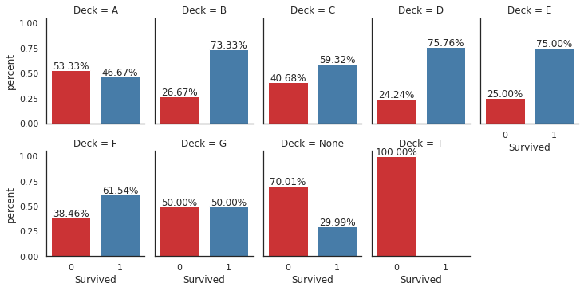

# Titanic - Machine Learning Kaggle Competition
---


**Descrição:**
\
Nesse notebook será analisado o dataset do [Titanic](https://www.kaggle.com/c/titanic/overview), referente a uma competição de Machine Learning do site Kaggle. O dataset é formado pelos seguintes dados:

|                Coluna                | Descrição |
|:------------------------------------:|:---------:|
|                  Survived                 |    Sobrevivência ou não (0 - não; 1- sim)       |
|                  Pclass                 |    Tipo de passagem (1a, 2a ou 3a classe)    |
|          SibSp   |    No. de irmãos/cônjuges a bordo do Titanic       |
| Parch |    No. de pais/filhos a bordo do Titanic       |
|      Ticket   |      No. do tíquete    |
|       Fare       |    Tarifa de passageiro       |
|                Cabin               |       Número da cabine    |
|    Embarked  |      Porto de embarcação (C - Cherbourg, Q - Queenstown, S - Southampton)     |


### 1 - Leitura dos dados e realização de descrição estatística
---


```python
import pandas as pd
```


```python
# Importa o dataframe
dataset = pd.read_csv('https://raw.githubusercontent.com/franklinthony/dataset/master/titanic_disaster.csv', sep = ',')
dataset
```


<div>
<style scoped>
    .dataframe tbody tr th:only-of-type {
        vertical-align: middle;
    }

    .dataframe tbody tr th {
        vertical-align: top;
    }

    .dataframe thead th {
        text-align: right;
    }
</style>
<table border="1" class="dataframe">
  <thead>
    <tr style="text-align: right;">
      <th></th>
      <th>PassengerId</th>
      <th>Survived</th>
      <th>Pclass</th>
      <th>Name</th>
      <th>Sex</th>
      <th>Age</th>
      <th>SibSp</th>
      <th>Parch</th>
      <th>Ticket</th>
      <th>Fare</th>
      <th>Cabin</th>
      <th>Embarked</th>
    </tr>
  </thead>
  <tbody>
    <tr>
      <th>0</th>
      <td>1</td>
      <td>0</td>
      <td>3</td>
      <td>Braund, Mr. Owen Harris</td>
      <td>male</td>
      <td>22.0</td>
      <td>1</td>
      <td>0</td>
      <td>A/5 21171</td>
      <td>7.2500</td>
      <td>NaN</td>
      <td>S</td>
    </tr>
    <tr>
      <th>1</th>
      <td>2</td>
      <td>1</td>
      <td>1</td>
      <td>Cumings, Mrs. John Bradley (Florence Briggs Th...</td>
      <td>female</td>
      <td>38.0</td>
      <td>1</td>
      <td>0</td>
      <td>PC 17599</td>
      <td>71.2833</td>
      <td>C85</td>
      <td>C</td>
    </tr>
    <tr>
      <th>2</th>
      <td>3</td>
      <td>1</td>
      <td>3</td>
      <td>Heikkinen, Miss. Laina</td>
      <td>female</td>
      <td>26.0</td>
      <td>0</td>
      <td>0</td>
      <td>STON/O2. 3101282</td>
      <td>7.9250</td>
      <td>NaN</td>
      <td>S</td>
    </tr>
    <tr>
      <th>3</th>
      <td>4</td>
      <td>1</td>
      <td>1</td>
      <td>Futrelle, Mrs. Jacques Heath (Lily May Peel)</td>
      <td>female</td>
      <td>35.0</td>
      <td>1</td>
      <td>0</td>
      <td>113803</td>
      <td>53.1000</td>
      <td>C123</td>
      <td>S</td>
    </tr>
    <tr>
      <th>4</th>
      <td>5</td>
      <td>0</td>
      <td>3</td>
      <td>Allen, Mr. William Henry</td>
      <td>male</td>
      <td>35.0</td>
      <td>0</td>
      <td>0</td>
      <td>373450</td>
      <td>8.0500</td>
      <td>NaN</td>
      <td>S</td>
    </tr>
    <tr>
      <th>...</th>
      <td>...</td>
      <td>...</td>
      <td>...</td>
      <td>...</td>
      <td>...</td>
      <td>...</td>
      <td>...</td>
      <td>...</td>
      <td>...</td>
      <td>...</td>
      <td>...</td>
      <td>...</td>
    </tr>
    <tr>
      <th>886</th>
      <td>887</td>
      <td>0</td>
      <td>2</td>
      <td>Montvila, Rev. Juozas</td>
      <td>male</td>
      <td>27.0</td>
      <td>0</td>
      <td>0</td>
      <td>211536</td>
      <td>13.0000</td>
      <td>NaN</td>
      <td>S</td>
    </tr>
    <tr>
      <th>887</th>
      <td>888</td>
      <td>1</td>
      <td>1</td>
      <td>Graham, Miss. Margaret Edith</td>
      <td>female</td>
      <td>19.0</td>
      <td>0</td>
      <td>0</td>
      <td>112053</td>
      <td>30.0000</td>
      <td>B42</td>
      <td>S</td>
    </tr>
    <tr>
      <th>888</th>
      <td>889</td>
      <td>0</td>
      <td>3</td>
      <td>Johnston, Miss. Catherine Helen "Carrie"</td>
      <td>female</td>
      <td>NaN</td>
      <td>1</td>
      <td>2</td>
      <td>W./C. 6607</td>
      <td>23.4500</td>
      <td>NaN</td>
      <td>S</td>
    </tr>
    <tr>
      <th>889</th>
      <td>890</td>
      <td>1</td>
      <td>1</td>
      <td>Behr, Mr. Karl Howell</td>
      <td>male</td>
      <td>26.0</td>
      <td>0</td>
      <td>0</td>
      <td>111369</td>
      <td>30.0000</td>
      <td>C148</td>
      <td>C</td>
    </tr>
    <tr>
      <th>890</th>
      <td>891</td>
      <td>0</td>
      <td>3</td>
      <td>Dooley, Mr. Patrick</td>
      <td>male</td>
      <td>32.0</td>
      <td>0</td>
      <td>0</td>
      <td>370376</td>
      <td>7.7500</td>
      <td>NaN</td>
      <td>Q</td>
    </tr>
  </tbody>
</table>
<p>891 rows × 12 columns</p>
</div>


```python
# Utilizamos o método .info() para saber os tipos das colunas do dataframe. Podemos ver que o dataframe tem 7 colunas tipo numéricas e 5 colunas tipo object
#(string).
dataset.info()

```

    <class 'pandas.core.frame.DataFrame'>
    RangeIndex: 891 entries, 0 to 890
    Data columns (total 12 columns):
     #   Column       Non-Null Count  Dtype  
    ---  ------       --------------  -----  
     0   PassengerId  891 non-null    int64  
     1   Survived     891 non-null    int64  
     2   Pclass       891 non-null    int64  
     3   Name         891 non-null    object 
     4   Sex          891 non-null    object 
     5   Age          714 non-null    float64
     6   SibSp        891 non-null    int64  
     7   Parch        891 non-null    int64  
     8   Ticket       891 non-null    object 
     9   Fare         891 non-null    float64
     10  Cabin        204 non-null    object 
     11  Embarked     889 non-null    object 
    dtypes: float64(2), int64(5), object(5)
    memory usage: 83.7+ KB
    


```python
#Utilizamos .describe() para ver um panorama geral das medidas de posição e dispersão das variáveis numéricas do dataframe.
dataset.describe()
```


<div>
<style scoped>
    .dataframe tbody tr th:only-of-type {
        vertical-align: middle;
    }

    .dataframe tbody tr th {
        vertical-align: top;
    }

    .dataframe thead th {
        text-align: right;
    }
</style>
<table border="1" class="dataframe">
  <thead>
    <tr style="text-align: right;">
      <th></th>
      <th>PassengerId</th>
      <th>Survived</th>
      <th>Pclass</th>
      <th>Age</th>
      <th>SibSp</th>
      <th>Parch</th>
      <th>Fare</th>
    </tr>
  </thead>
  <tbody>
    <tr>
      <th>count</th>
      <td>891.000000</td>
      <td>891.000000</td>
      <td>891.000000</td>
      <td>714.000000</td>
      <td>891.000000</td>
      <td>891.000000</td>
      <td>891.000000</td>
    </tr>
    <tr>
      <th>mean</th>
      <td>446.000000</td>
      <td>0.383838</td>
      <td>2.308642</td>
      <td>29.699118</td>
      <td>0.523008</td>
      <td>0.381594</td>
      <td>32.204208</td>
    </tr>
    <tr>
      <th>std</th>
      <td>257.353842</td>
      <td>0.486592</td>
      <td>0.836071</td>
      <td>14.526497</td>
      <td>1.102743</td>
      <td>0.806057</td>
      <td>49.693429</td>
    </tr>
    <tr>
      <th>min</th>
      <td>1.000000</td>
      <td>0.000000</td>
      <td>1.000000</td>
      <td>0.420000</td>
      <td>0.000000</td>
      <td>0.000000</td>
      <td>0.000000</td>
    </tr>
    <tr>
      <th>25%</th>
      <td>223.500000</td>
      <td>0.000000</td>
      <td>2.000000</td>
      <td>20.125000</td>
      <td>0.000000</td>
      <td>0.000000</td>
      <td>7.910400</td>
    </tr>
    <tr>
      <th>50%</th>
      <td>446.000000</td>
      <td>0.000000</td>
      <td>3.000000</td>
      <td>28.000000</td>
      <td>0.000000</td>
      <td>0.000000</td>
      <td>14.454200</td>
    </tr>
    <tr>
      <th>75%</th>
      <td>668.500000</td>
      <td>1.000000</td>
      <td>3.000000</td>
      <td>38.000000</td>
      <td>1.000000</td>
      <td>0.000000</td>
      <td>31.000000</td>
    </tr>
    <tr>
      <th>max</th>
      <td>891.000000</td>
      <td>1.000000</td>
      <td>3.000000</td>
      <td>80.000000</td>
      <td>8.000000</td>
      <td>6.000000</td>
      <td>512.329200</td>
    </tr>
  </tbody>
</table>
</div>


### 2 Limpeza dos dados
---


```python
# Vamos ver primeiramente a quantidade de missing values em cada coluna. 
dataset.isna().sum()

```


    PassengerId      0
    Survived         0
    Pclass           0
    Name             0
    Sex              0
    Age            177
    SibSp            0
    Parch            0
    Ticket           0
    Fare             0
    Cabin          687
    Embarked         2
    dtype: int64


Agora iremos encontrar soluções para tratar os missing values do dataframe.
* Em relação à coluna "Age", podemos substituir os missing values pela média ou mediana. Em output anterior, vimos que são valores bem próximos. Ademais, com o intuito de deixar a análise mais precisa, podemos calcular a mediana da coluna "Age" agrupada pela coluna "Pclass". Como as passagens da 1ª classe são mais caras, é possível supor que a mediana de idades dessa classe é maior que as outras. Vamos investigar essa hipótese explorando os dados.


```python
# Importar numpy para calcular a mediana
import numpy as np
# Calcular a mediana das idades agrupar por classe
dataset.groupby("Pclass")["Age"].agg(np.median)
```


    Pclass
    1    37.0
    2    29.0
    3    24.0
    Name: Age, dtype: float64


```python
# Observamos que a mediana da idade realmente é diferente para cada classe de passageiro. Agora vamos criar uma função para poder substituir os missing values
# pela mediana, de acordo com a classe do passageiro
def impute_age(cols):
    Age = cols[0]
    Pclass = cols[1]
    
    if pd.isnull(Age):

        if Pclass == 1:
            return 37

        elif Pclass == 2:
            return 29

        else:
            return 24

    else:
        return Age

# Vamos agora aplicar a função
dataset['Age'] = dataset[['Age','Pclass']].apply(impute_age,axis=1)

# Checar se ainda existem missing values na coluna age
dataset.isna().sum()
```


    PassengerId      0
    Survived         0
    Pclass           0
    Name             0
    Sex              0
    Age              0
    SibSp            0
    Parch            0
    Ticket           0
    Fare             0
    Cabin          687
    Embarked         2
    dtype: int64


* Em relação a coluna "Cabin", vamos tratá-la posteriormente na fase de Feature Engineering.
* Os missing values da coluna "Embarked" são muito poucos (2 de 889), então iremos retirá-los do dataframe.


```python
# Retirar as instâncias com "Embarked" = NaN
dataset.dropna(subset = ['Embarked'], inplace = True)

# Checar os missing values em cada coluna
dataset.isna().sum()
```


    PassengerId      0
    Survived         0
    Pclass           0
    Name             0
    Sex              0
    Age              0
    SibSp            0
    Parch            0
    Ticket           0
    Fare             0
    Cabin          687
    Embarked         0
    dtype: int64


### 3 - Feature Engineering
---


```python
# Já vimos que a coluna Cabin tem muitos missing values. Vamos ver agora quantos valores únicos tem a coluna Cabin
dataset['Cabin'].value_counts()
```


    C23 C25 C27    4
    B96 B98        4
    G6             4
    F33            3
    E101           3
                  ..
    D28            1
    C86            1
    E77            1
    D56            1
    B3             1
    Name: Cabin, Length: 146, dtype: int64


Observamos acima que, além dos vários missing values, a coluna tem muitos valores únicos. Uma alternativa seria excluir essa coluna do dataframe; porém é possível que ela traga valor ao nosso modelo. 

Nós vemos que cada cabine começa por uma letra. Essa letra indica o deck em que a cabine está, ou seja, indica a localização da cabine no navio.
Portanto, ela pode dar uma informação importante em relação a chance de sobrevivência do passageiro, pois em determinada cabine os botes de salva-vidas podem estar mais perto. Também podem estar relacionadas à colunas PClass, pois passageiros em classes iguais tendem a ficar na mesma área ou em áreas próximas no navio. 

Dessa forma, iremos partir a coluna da cabine, isolando parte da letra dos números.


```python
# Cria uma coluna que separa a cabine do número
dataset['Deck'] = dataset["Cabin"].str.slice(0,1)
# Substitui os NA na coluna 'Deck' por 'None', para indicar que não há cabine registrada para o respectivo passageiro.
dataset['Deck'] = dataset["Deck"].fillna('None')
dataset['Deck'].value_counts()

```


    None    687
    C        59
    B        45
    D        33
    E        32
    A        15
    F        13
    G         4
    T         1
    Name: Deck, dtype: int64


Também vemos que na coluna "Name" de cada passageiro, o nome é precedido por um título. Já que o nome será uma coluna que iremos excluir do modelo, podemos separar a parte do título, pois ela pode dar informações relevantes.


```python
# Cria coluna Title
dataset['Title'] = dataset['Name'].str.extract(' ([A-Za-z]+)\.', expand=False)
dataset['Title'].value_counts()
```


    Mr          517
    Miss        181
    Mrs         124
    Master       40
    Dr            7
    Rev           6
    Mlle          2
    Major         2
    Col           2
    Lady          1
    Don           1
    Mme           1
    Countess      1
    Capt          1
    Ms            1
    Jonkheer      1
    Sir           1
    Name: Title, dtype: int64


```python
# Abaixo do título "Master", tem vários outros títulos com poucas observações. Iremos agrupar esses títulos em um só, chamado "Other".
dataset['Title'] = dataset['Title'].replace(['Dr', 'Rev', 'Col',
    'Mlle', 'Major', 'Jonkheer', 'Countess', 'Mme', 'Ms', 'Sir', 'Lady', 'Capt', 'Don'], 'Other')
dataset['Title'].value_counts()
```


    Mr        517
    Miss      181
    Mrs       124
    Master     40
    Other      27
    Name: Title, dtype: int64


```python
# Agora iremos analisar a coluna "Ticket"
dataset['Ticket'].value_counts()
```


    1601                 7
    CA. 2343             7
    347082               7
    3101295              6
    347088               6
                        ..
    2624                 1
    SC/AH 3085           1
    370376               1
    STON/O 2. 3101275    1
    367228               1
    Name: Ticket, Length: 680, dtype: int64


```python
# A coluna "Ticket" possui muitos valores distintos, portanto iremos retirá-la do dataframe. Junto com ela, iremos retirar a coluna "Name" e "Cabin".
dataset.drop(['Ticket', 'Name', 'Cabin'], axis = 1, inplace=True)
dataset.head()
```


<div>
<style scoped>
    .dataframe tbody tr th:only-of-type {
        vertical-align: middle;
    }

    .dataframe tbody tr th {
        vertical-align: top;
    }

    .dataframe thead th {
        text-align: right;
    }
</style>
<table border="1" class="dataframe">
  <thead>
    <tr style="text-align: right;">
      <th></th>
      <th>PassengerId</th>
      <th>Survived</th>
      <th>Pclass</th>
      <th>Sex</th>
      <th>Age</th>
      <th>SibSp</th>
      <th>Parch</th>
      <th>Fare</th>
      <th>Embarked</th>
      <th>Deck</th>
      <th>Title</th>
    </tr>
  </thead>
  <tbody>
    <tr>
      <th>0</th>
      <td>1</td>
      <td>0</td>
      <td>3</td>
      <td>male</td>
      <td>22.0</td>
      <td>1</td>
      <td>0</td>
      <td>7.2500</td>
      <td>S</td>
      <td>None</td>
      <td>Mr</td>
    </tr>
    <tr>
      <th>1</th>
      <td>2</td>
      <td>1</td>
      <td>1</td>
      <td>female</td>
      <td>38.0</td>
      <td>1</td>
      <td>0</td>
      <td>71.2833</td>
      <td>C</td>
      <td>C</td>
      <td>Mrs</td>
    </tr>
    <tr>
      <th>2</th>
      <td>3</td>
      <td>1</td>
      <td>3</td>
      <td>female</td>
      <td>26.0</td>
      <td>0</td>
      <td>0</td>
      <td>7.9250</td>
      <td>S</td>
      <td>None</td>
      <td>Miss</td>
    </tr>
    <tr>
      <th>3</th>
      <td>4</td>
      <td>1</td>
      <td>1</td>
      <td>female</td>
      <td>35.0</td>
      <td>1</td>
      <td>0</td>
      <td>53.1000</td>
      <td>S</td>
      <td>C</td>
      <td>Mrs</td>
    </tr>
    <tr>
      <th>4</th>
      <td>5</td>
      <td>0</td>
      <td>3</td>
      <td>male</td>
      <td>35.0</td>
      <td>0</td>
      <td>0</td>
      <td>8.0500</td>
      <td>S</td>
      <td>None</td>
      <td>Mr</td>
    </tr>
  </tbody>
</table>
</div>


```python
# Codifica as colunas de dados categóricos
dataset_encoded = pd.get_dummies(data=dataset, columns = ['Sex', 'Embarked', 'Deck', 'Title'])
dataset_encoded.head()

```


<div>
<style scoped>
    .dataframe tbody tr th:only-of-type {
        vertical-align: middle;
    }

    .dataframe tbody tr th {
        vertical-align: top;
    }

    .dataframe thead th {
        text-align: right;
    }
</style>
<table border="1" class="dataframe">
  <thead>
    <tr style="text-align: right;">
      <th></th>
      <th>PassengerId</th>
      <th>Survived</th>
      <th>Pclass</th>
      <th>Age</th>
      <th>SibSp</th>
      <th>Parch</th>
      <th>Fare</th>
      <th>Sex_female</th>
      <th>Sex_male</th>
      <th>Embarked_C</th>
      <th>Embarked_Q</th>
      <th>Embarked_S</th>
      <th>Deck_A</th>
      <th>Deck_B</th>
      <th>Deck_C</th>
      <th>Deck_D</th>
      <th>Deck_E</th>
      <th>Deck_F</th>
      <th>Deck_G</th>
      <th>Deck_None</th>
      <th>Deck_T</th>
      <th>Title_Master</th>
      <th>Title_Miss</th>
      <th>Title_Mr</th>
      <th>Title_Mrs</th>
      <th>Title_Other</th>
    </tr>
  </thead>
  <tbody>
    <tr>
      <th>0</th>
      <td>1</td>
      <td>0</td>
      <td>3</td>
      <td>22.0</td>
      <td>1</td>
      <td>0</td>
      <td>7.2500</td>
      <td>0</td>
      <td>1</td>
      <td>0</td>
      <td>0</td>
      <td>1</td>
      <td>0</td>
      <td>0</td>
      <td>0</td>
      <td>0</td>
      <td>0</td>
      <td>0</td>
      <td>0</td>
      <td>1</td>
      <td>0</td>
      <td>0</td>
      <td>0</td>
      <td>1</td>
      <td>0</td>
      <td>0</td>
    </tr>
    <tr>
      <th>1</th>
      <td>2</td>
      <td>1</td>
      <td>1</td>
      <td>38.0</td>
      <td>1</td>
      <td>0</td>
      <td>71.2833</td>
      <td>1</td>
      <td>0</td>
      <td>1</td>
      <td>0</td>
      <td>0</td>
      <td>0</td>
      <td>0</td>
      <td>1</td>
      <td>0</td>
      <td>0</td>
      <td>0</td>
      <td>0</td>
      <td>0</td>
      <td>0</td>
      <td>0</td>
      <td>0</td>
      <td>0</td>
      <td>1</td>
      <td>0</td>
    </tr>
    <tr>
      <th>2</th>
      <td>3</td>
      <td>1</td>
      <td>3</td>
      <td>26.0</td>
      <td>0</td>
      <td>0</td>
      <td>7.9250</td>
      <td>1</td>
      <td>0</td>
      <td>0</td>
      <td>0</td>
      <td>1</td>
      <td>0</td>
      <td>0</td>
      <td>0</td>
      <td>0</td>
      <td>0</td>
      <td>0</td>
      <td>0</td>
      <td>1</td>
      <td>0</td>
      <td>0</td>
      <td>1</td>
      <td>0</td>
      <td>0</td>
      <td>0</td>
    </tr>
    <tr>
      <th>3</th>
      <td>4</td>
      <td>1</td>
      <td>1</td>
      <td>35.0</td>
      <td>1</td>
      <td>0</td>
      <td>53.1000</td>
      <td>1</td>
      <td>0</td>
      <td>0</td>
      <td>0</td>
      <td>1</td>
      <td>0</td>
      <td>0</td>
      <td>1</td>
      <td>0</td>
      <td>0</td>
      <td>0</td>
      <td>0</td>
      <td>0</td>
      <td>0</td>
      <td>0</td>
      <td>0</td>
      <td>0</td>
      <td>1</td>
      <td>0</td>
    </tr>
    <tr>
      <th>4</th>
      <td>5</td>
      <td>0</td>
      <td>3</td>
      <td>35.0</td>
      <td>0</td>
      <td>0</td>
      <td>8.0500</td>
      <td>0</td>
      <td>1</td>
      <td>0</td>
      <td>0</td>
      <td>1</td>
      <td>0</td>
      <td>0</td>
      <td>0</td>
      <td>0</td>
      <td>0</td>
      <td>0</td>
      <td>0</td>
      <td>1</td>
      <td>0</td>
      <td>0</td>
      <td>0</td>
      <td>1</td>
      <td>0</td>
      <td>0</td>
    </tr>
  </tbody>
</table>
</div>


### 4 Análise Exploratória dos dados


```python
# Gráficos com a distribuição das colunas Age, Fare, SibSp e Parch
import matplotlib.pyplot as plt
import seaborn as sns
sns.set_theme(style='darkgrid')
f, axs = plt.subplots(2 , 2, figsize=(15,10))
sns.countplot(data=dataset_encoded, x="Survived", ax=axs[0,0])
sns.countplot(data=dataset_encoded, x="Pclass", ax=axs[0,1])
sns.countplot(data=dataset, x="Sex", ax=axs[1,0])
sns.countplot(data=dataset, x="Embarked", ax=axs[1,1])


```


    <matplotlib.axes._subplots.AxesSubplot at 0x7f93adad5950>


    

    


```python
# Histogramas das colunas Age, Fare, SibSp e Parch
f, axs = plt.subplots(2 , 2, figsize=(15,10))
sns.histplot(data=dataset_encoded, x = "Age", ax=axs[0,0], binwidth=5)
sns.histplot(data=dataset_encoded, x = "Fare", ax=axs[0,1], binwidth=10, color='tab:red')
sns.histplot(data=dataset_encoded, x = "SibSp", ax=axs[1,0], binwidth=1, color='green')
sns.histplot(data=dataset_encoded, x = "Parch", ax=axs[1,1], binwidth=1, color='gold')
```


    <matplotlib.axes._subplots.AxesSubplot at 0x7f93ad531e50>


    

    


```python
# Vendo a distribuição da coluna Survived por Pclass, Sex e Embarked
f, axs = plt.subplots(1 , 3, figsize=(14,4))
sns.countplot(data=dataset_encoded, x="Survived", hue = "Pclass", ax=axs[0])
sns.countplot(data=dataset, x="Survived", hue = "Sex", ax=axs[1])
sns.countplot(data=dataset, x="Survived", hue="Embarked", ax=axs[2])
```


    <matplotlib.axes._subplots.AxesSubplot at 0x7f93ad34e210>


    

    


```python
# Cria um dataframe com tipo do Deck e a % de Survived
sns.set_theme(style="white")
ds1 = dataset.groupby('Deck')['Survived'].value_counts(normalize=True)
ds1 = ds1.rename('percent').reset_index()

#Cria os gráficos
g = sns.catplot(x="Survived", y="percent", col = 'Deck',
                data=ds1,
                kind="bar", height=2.5,aspect=.8, col_wrap=5, palette='Set1')

# Adiciona a % acima da barra de cada gráfico
for ax in g.axes.ravel():
  for p in ax.patches:
    ax.annotate('{:.2%}'.format(p.get_height()), (p.get_x() + p.get_width() / 2., p.get_height()), ha = 'center', va = 'center', xytext = (0, 5), textcoords = 'offset points')

```


    

    


```python
# Cria um dataframe com tipo do Deck e a % de Survived
ds2 = dataset.groupby('Title')['Survived'].value_counts(normalize=True)
ds2 = ds2.rename('percent').reset_index()

h = sns.catplot(x="Survived", y="percent",col="Title", col_wrap=5,
                data=ds2,
                kind="bar", height=2.5, aspect=.8, palette="Set1")
h.set(ylim=(0,1))

# Adiciona a % acima da barra de cada gráfico
for ax in h.axes.ravel():
  for p in ax.patches:
    ax.annotate('{:.2%}'.format(p.get_height()), (p.get_x() + p.get_width() / 2., p.get_height()), ha = 'center', va = 'center', xytext = (0, 5), textcoords = 'offset points')

```


    

    


```python
# Cria Boxplots das colunas Age e Fare.
sns.set_theme(style="whitegrid")
f, axs = plt.subplots(2 , 2, figsize=(15,10))
sns.boxplot(data=dataset_encoded, x="Age", ax=axs[0,0])
sns.boxplot(data=dataset_encoded, x="Fare",ax=axs[0,1], color="tab:red")

# Cria Boxplots da Coluna Age categorizada por Pclass e Sex 
sns.boxplot(data=dataset, x="Pclass", y="Age", hue="Sex",ax=axs[1,0], palette="Set3")

# Cria Boxplots da Coluna Age categorizada por Survided e Sex 
sns.boxplot(data=dataset, x="Survived", y="Age",hue="Sex",ax=axs[1,1], palette="Set2")


```


    <matplotlib.axes._subplots.AxesSubplot at 0x7f93ad227310>


    

    


```python
# Boxplot da coluna Fare categorizada por Embarked. Vemos que a mediana do preço da passagem de quem embarcou em Cherbourg é maior.
sns.boxplot(data=dataset, x="Embarked", y="Fare", palette="Set1")

```


    <matplotlib.axes._subplots.AxesSubplot at 0x7f93a42a96d0>


    

    


### 5 Machine Learning
Vamos construir um modelo de regressão logística para prever se um passageiro sobreviveu ou não. A escolha da Regressão Logística se dá porque o problema em questão é de classificação com um resultado binário (Survived = 0 ou 1).


```python
# Importa as bibliotecas necessárias.
from sklearn.model_selection import train_test_split
from sklearn.linear_model import LogisticRegression
from sklearn.metrics import confusion_matrix, accuracy_score, classification_report

# Separa o dataframe em treino e teste
X_train, X_test, y_train, y_test = train_test_split(dataset_encoded.drop(['Survived', 'PassengerId'] ,axis=1), 
                                                    dataset_encoded['Survived'], test_size=0.3, 
                                                  random_state=101)
# Treina o modelo de regressão logística 
logmodel = LogisticRegression(max_iter=600)
logmodel.fit(X_train,y_train)

# Faz as predições no dataset de teste
predictions = logmodel.predict(X_test)

# Calcula a Confusion Matrix
confmatrix=confusion_matrix(y_test,predictions)
print(confmatrix)
# A confusion matrix nos diz que tivemos 153 (verdadeiros positivos) + 77 (verdadeiros negativos) = 230 (previsões corretas). Por outro lado,
# tivemos 10 Falsos Negativos e 27 Falsos positivos, o que totaliza 37 previsões incorretas.
```

    [[153  10]
     [ 27  77]]
    


```python
# Calcula a acurácia do modelo. É a soma das previsões corretas dividido pelo número total de previsões.
accuracy=accuracy_score(y_test,predictions)
accuracy
#print(classification_report(y_test,predictions))
```


    0.8614232209737828


```python
# Mostra o Classification Report
print(classification_report(y_test,predictions))

# precision é a acurácia das predições positivas
# precision = [True Positive/(True Positive + False Positive)]

# recall é a fração de predições positivas que foram corretamente identificadas.
# precision = [True Positive/(True Positive + False Negative)]

# f1-score é uma métrica de acurácia do modelo, que combina as métricas precision e recall calculando a média harmônica entre elas.
# F1 = 2 * (precision * recall) / (precision + recall)

# Support é a ocorrência de cada classe de resultado 
```

                  precision    recall  f1-score   support
    
               0       0.85      0.94      0.89       163
               1       0.89      0.74      0.81       104
    
        accuracy                           0.86       267
       macro avg       0.87      0.84      0.85       267
    weighted avg       0.86      0.86      0.86       267
    
    
